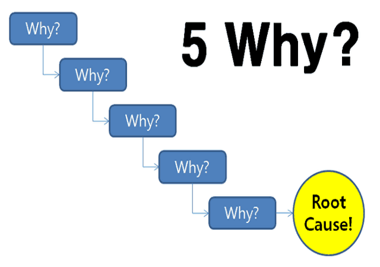

# How To Solve Programming problems

## Some good tools to enable you to get good at solving programming problems.
### A simple set of steps:
1. Read the problem completely twice.
2. Solve the problem manually with 3 sets of sample data.
3. Optimize the manual steps.
4. Write the manual steps as comments or pseudo-code.
5. Replace the comments or pseudo-code with real code.
6. Optimize the real code.

# Pretend Your Time is Worth $1,000/Hour and You’ll Become 100x More Productive:
## here are some motivational quote:
- Most people have no clue what they are doing with their time but still complain that they don’t have enough.” -Grant Cardone, NYT best-selling author.
- “Busyness” Isn’t a Badge of Honor; It’s a Sign of Weakness.
- “Being busy is a form of mental laziness.” -Tim Ferriss.
- “People are unhappy in large part because they are confused about what is valuable.” -William Irvine.
- Extremely successful people don’t tolerate busywork or distraction. They have crystal clear vision on their goals, and do what they need to do to get there, every single day.
- “People are unhappy in large part because they are confused about what is valuable.”
- You Can Do Amazing Things, But Only If You Have Time to Do Them.

# How to think like a programmer :
1. Try a solution.
2. If that doesn’t work, try another one.
3. If that doesn’t work, repeat step 2 until you luck out.

# what should you do when you encounter a new problem?
## Here are the steps:
1. Understand:Know exactly what is being asked. Most hard problems are hard because you don’t understand them .
2. Plan Don’t dive right into solving without a plan.
3. Divide  break it into sub-problems. These sub-problems are much easier to solve.
4. Stuck :In fact, here are three things to try when facing a whammy:
- Debug: Go step by step through your solution trying to find where you went wrong. 
- Reassess: Take a step back. Look at the problem from another perspective. 
- Research and doing Practice.

# the 5 Whys technique **(5Y)**:
## When to Use a 5 Whys Analysis
You can use 5 Whys for troubleshooting, quality improvement, and problem solving, but it is most effective when used to resolve simple or moderately difficult problems.

# How to Use the 5 Whys:
1. Assemble a Team :Gather together people who are familiar with the specifics of the problem, and with the process that you're trying to fix. Include someone to act as a facilitator , who can keep the team focused on identifying effective counter-measures.
2. Define the Problem :observe the problem in action. Discuss it with your team and write a brief, clear problem statement that you all agree on.
3. Ask the First "Why?":Ask your team why the problem is occurring.
4. Ask "Why?" Four More Times:For each of the answers that you generated in Step 3, ask four further "whys" in success.
5. Know When to Stop.
6. Address the Root Cause(s).
7. Monitor Your Measures :Keep a close watch on how effectively your counter-measures eliminate or minimize the initial problem. 

## here are WHY example of Multiple lanes:

